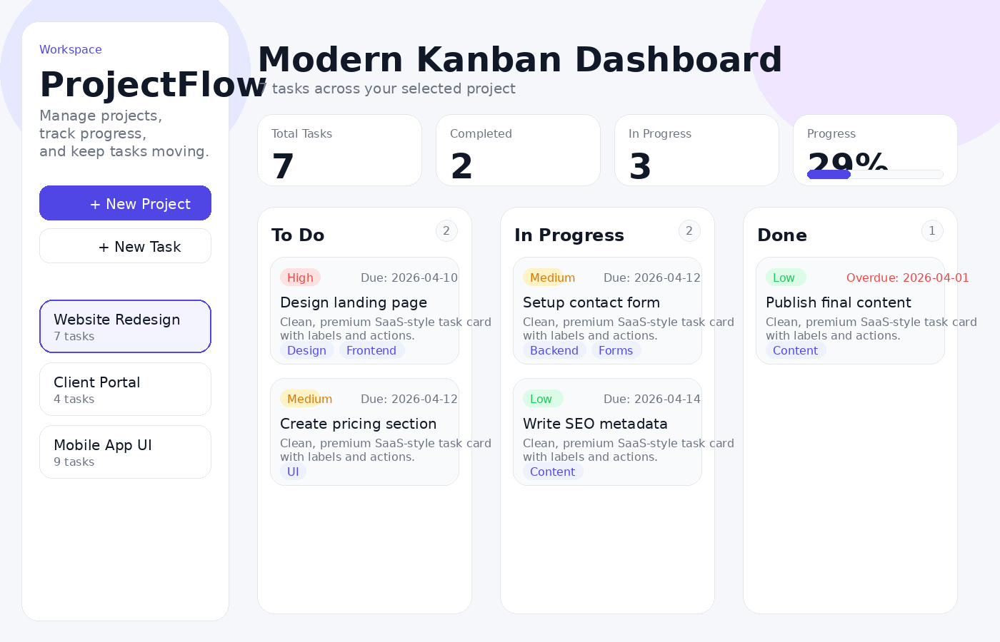

# 🧠 TaskFlow – Modern Task Management App


A modern Kanban-style project management app built with **Vue.js** for organizing projects and tasks in a clean, premium SaaS-inspired interface.

**Live Demo:** [ProjectFlow](https://hasan1303.github.io/projectflow/)  
**Repository:** [GitHub Repo](https://github.com/hasan1303/projectflow)

---

## Preview



---

## Overview

ProjectFlow is a portfolio-ready task and project management application designed to simulate a real-world productivity dashboard.  
Users can create projects, add tasks, move them across workflow stages, set priorities, sort tasks, and monitor project activity through an elegant and responsive UI.

The goal of this project was to build something that feels more like a real SaaS product than a basic student app.

---

## Features

- Create and manage multiple projects
- Add, edit, and delete tasks
- Kanban board with real drag & drop
- Task workflow columns:
  - To Do
  - In Progress
  - Done
- Project-based task counter
- Priority filtering
- Search tasks instantly
- Sort by:
  - Due date
  - Newest
  - Oldest
- Overdue task styling
- Progress statistics
- Activity log
- Toast notifications
- Empty states with polished UI
- Data persistence with localStorage
- Responsive layout for desktop and mobile

---

## Tech Stack

- **Vue.js 3**
- **Vite**
- **JavaScript (ES6+)**
- **CSS3**
- **GitHub Pages** for deployment

---

## Why This Project?

This project was built to strengthen practical frontend development skills with Vue.js while creating a polished portfolio piece.

It demonstrates:

- component-based architecture
- state-driven UI
- reusable Vue components
- drag and drop interactions
- conditional rendering
- filtering and sorting logic
- localStorage persistence
- clean responsive design
- deployment workflow with GitHub Pages

---

## Project Structure

```bash
projectflow/
│── .github/
│   └── workflows/
│       └── deploy.yml
│── public/
│── src/
│   ├── assets/
│   │   └── styles.css
│   ├── components/
│   │   ├── AddTaskModal.vue
│   │   ├── AppHeader.vue
│   │   ├── EditTaskModal.vue
│   │   ├── PriorityFilter.vue
│   │   ├── ProjectBoard.vue
│   │   ├── ProjectSelector.vue
│   │   ├── SearchBar.vue
│   │   ├── SortSelect.vue
│   │   ├── TaskCard.vue
│   │   ├── TaskColumn.vue
│   │   └── ToastContainer.vue
│   ├── composables/
│   │   └── useLocalStorage.js
│   ├── App.vue
│   └── main.js
│── index.html
│── package.json
│── vite.config.js
│── README.md
│── preview.png
